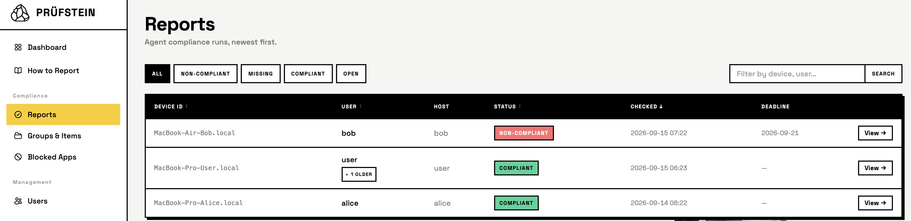
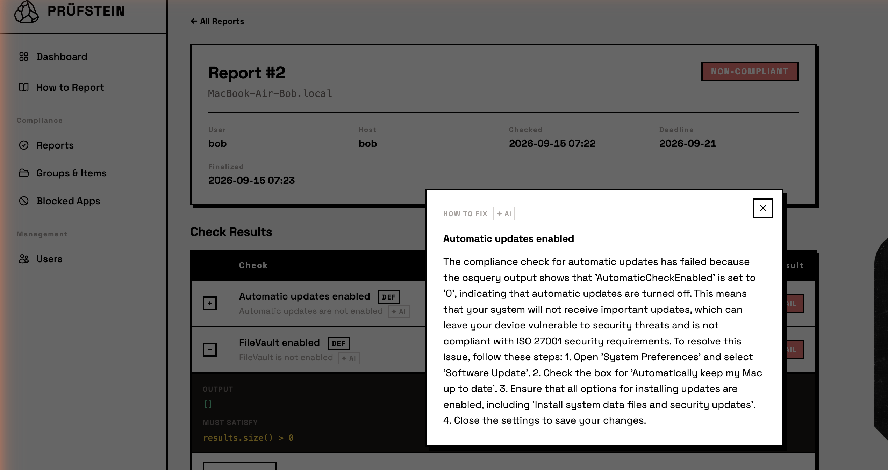

<div align="center">


<br>

[](https://github.com/explore-de/pruefstein/actions/workflows/ci.yml)
[](https://github.com/explore-de/pruefstein/releases/latest)
[](https://github.com/explore-de/homebrew-pruefstein)
[](#local-agent)
[](LICENSE)

**ISO 27001 device compliance, without spying on your team.**

</div>

---

Prüfstein checks every employee Mac against the controls you wrote down, using
[osquery](https://osquery.io/). Nothing runs in the background, nothing is filed
until the person at the keyboard says so, and the fleet data never leaves your
infrastructure. It is one repository under Apache-2.0 — no core edition, no
feature held back for a paid tier.

```bash
brew install --cask osquery
brew install explore-de/pruefstein/pruefstein-agent
pruefstein-agent login --server https://pruefstein.example.com
pruefstein-agent run
```

Admins get a web app for writing the checks and reading the results; everybody
else gets that one command. Self-hosted, on your own PostgreSQL and your own
identity provider.

**[Read more →](https://explore-de.github.io/pruefstein/)**

---

## How it works

The web app (Quarkus) lets admins define Compliance Items: each item belongs to a ComplianceGroup (e.g. "A.8 Asset Management") and contains a SQL query and a JEXL pass/fail expression. The dashboard shows per-user/device compliance Reports, each containing a ComplianceResult per item.

A lightweight local agent runs on each employee's machine. It fetches all ComplianceItems via `GET /api/checks`, executes each SQL query through osquery, evaluates the result against the expected expression, and — once the person running it says so — POSTs a Report back via `POST /api/reports`. Checking is free and repeatable; reporting is the deliberate step, so a machine can be checked and fixed as often as needed before anything is filed. For a schedule (cron, launchd, systemd) `--yes` answers the question up front.

---

## What it looks like

The reports list as an admin sees it — everyone else sees only their own
machines:



A failed check opens onto the JSON osquery actually returned and the expression
it was judged against, and the model writes the way out of it:



And the person whose Mac it is gets their own page: a verdict, the failing
checks as a list of things to do, and the date the next run is wanted.

---

## Domain model

| Entity | Key fields | Purpose |
|---|---|---|
| `AppUser` | oidcSubject, firstname, lastname, mail | An employee whose devices are checked |
| `Device` | deviceId, appUser, lastReportAt | One machine, and when it last proved itself |
| `ComplianceGroup` | name, retiredAt | Groups related items (maps to ISO 27001 control family). Retired rather than deleted — see [Retiring a check](#retiring-a-check) |
| `ComplianceItem` | name, group, retiredAt | One check. `ExpressionCheck` carries a query and a JEXL expression; `AppBlacklistCheck` generates its query from the `BlockedApp` rules. Retired rather than deleted — see [Retiring a check](#retiring-a-check) |
| `Report` | deviceId, userId, checkedAt, status, deadline, osVersion, osLatestVersion | One agent run for one device. `status` is COMPLIANT, NON_COMPLIANT, MISSING or OPEN — open meaning the repair window has not run out yet. Carries the macOS the device was running and the newest Apple had published at the time — see [macOS versions](#macos-versions) |
| `ComplianceResult` | item, report, passed, output, aiShortDescription | Outcome of one check in one report, with the JSON osquery returned and the model's reading of it |
| `MacOsRelease` | productVersion, build, postingDate, publicRelease | One macOS release as Apple's feed described it — the catalog a report's version is judged against |

---

## Compliance Items

A Compliance Item is a SQL query against the [osquery schema](https://www.osquery.io/schema/) plus a **[JEXL](https://commons.apache.org/proper/commons-jexl/) expression** that is evaluated against the full JSON result array. The expression must return `true` for the check to pass.

The JEXL context exposes `results` — the parsed JSON array returned by `osqueryi --json`.

**Example — disk encryption (macOS):**
```sql
SELECT encrypted FROM mounts WHERE path = '/';
```
```jexl
results[0].encrypted == "1"
```

**Example — firewall enabled (macOS):**
```sql
SELECT global_state FROM alf;
```
```jexl
results[0].global_state == "1"
```

**Example — screen lock timeout ≤ 300 s:**
```sql
SELECT value FROM preferences WHERE domain = 'com.apple.screensaver' AND key = 'idleTime';
```
```jexl
results[0].value =~ '\d+' && Integer.parseInt(results[0].value) <= 300
```

**Example — no unknown listening ports:**
```sql
SELECT DISTINCT port FROM listening_ports WHERE pid != 0;
```
```jexl
results.size() == 0
```

### Retiring a check

A check cannot be deleted, because every result it ever produced points back at
it — removing the row would take the findings that justify past reports with it.
Deleting one in the UI **retires** it instead: `retiredAt` is stamped, and from
that moment the check is gone from its group, from the catalogue the agent
fetches, and from every count on the dashboard. Agents stop running it on their
next run; nothing needs to be resynced.

Reports already filed keep the check, and it now reads as **passed** there — on
devices that failed it too. A device cannot be held to a rule that has been
withdrawn, and it certainly cannot fix one. So a retired check also stops
counting towards an open report's deadline, drops out of the personal dashboard's
to-do list, and is left out of outcome mails and of the AI enrichment queue.

Nothing is rewritten to achieve this. The recorded `passed` flag and the osquery
output stay exactly as the device reported them, and the report explains in place
why the row is green — including what the device originally answered and when the
check was retired. The row's link back to the catalogue is dropped, since there is
no entry left to point at; the query and expression it was judged by are on the
expanded row instead.

Groups work the same way and for the same reason — past reports name the group of
every check they record. Deleting a group retires it **and every check in it**,
because the group screen is the only place those checks can be managed. A retired
group leaves the index, its own page returns 404, and its name is free to be used
again: the catalogue seeder matches groups by name among the ones still in force,
so a check shipped in a later release is never filed into a group nobody can
reach.

### Withdrawn: the screen lock timeout

`screen-lock-timeout` is gone. Databases that seeded it had it retired by a
one-off migration in v1.0.3 — a check cannot be deleted, so the reports naming
it keep their rows. It demanded an `idleTime` under `com.apple.screensaver`, and
macOS no longer keeps one there: on a current machine the domain does not exist
at all, and the sandboxed screen saver container osquery would have to read
instead needs Full Disk Access the agent does not have. It therefore failed
devices that lock perfectly well — the reference Mac this was checked against
has no `idleTime` anywhere, a display that sleeps after two minutes (`pmset -g
custom`, which no osquery table exposes) and a 300-second grace period.

What is left measurable is the `screenlock` table, `enabled` and `grace_period`,
which is what `screen-lock-password` already reads. Anything wanting the real
idle time needs a source outside osquery's schema, or a profile that writes
`idleTime` where the old check could see it.

### Not built: Enhanced Safe Browsing

Left out on purpose, and worth reading before trying again. Chrome's Enhanced
Safe Browsing is enforceable — `SafeBrowsingProtectionLevel` set to 2 by a
configuration profile, device-wide or per user — and Safari has no comparable
tier at all, only `WarnAboutFraudulentWebsites`. No other browser can be held to
either. Checks for both were written, shipped and removed again (`844ef87`),
because without an MDM they reported fail on every device, and a check that can
never pass teaches people to skip the report.

What was learned on the way, so the next attempt need not rediscover it:

- **Only the managed copy is readable.** A setting the user chose in Chrome
  lives in a JSON file inside their Chrome profile, which has no osquery table,
  and Safari's equivalent sits in its sandbox container — `file` sees that
  plist, `plist` returns nothing for it, because reading it needs Full Disk
  Access the agent does not have. So "enforced by a profile" is the only state
  that can be measured, and a profile installed by hand lands in
  `/Library/Managed Preferences/` exactly like a pushed one.
- **`plist` drops rows when a query mixes `path =` and `path LIKE`.** Both
  constraints reach the table, and it honours one of them. Reading a device-wide
  and a per-user managed plist together therefore needs `UNION ALL`, one branch
  per path shape. `screen-lock-timeout` shipped with the older pattern and read
  one of its three path shapes — by-host, where macOS keeps most of
  `com.apple.screensaver`, was the one being dropped. That check has since been
  withdrawn for the reason below, so the trap is documented rather than fixed in
  place.
- **`%` in a `LIKE` path does not cross a `/`.** `'/Library/Managed
  Preferences/%/com.google.Chrome.plist'` matches the per-user copies and only
  those; `%%` is what spans directories.
- **The keys are spent.** `chrome-enhanced-safe-browsing` and
  `safari-fraud-warning` were seeded once, so the ledger in any database that
  booted on `9b5bab6` has already claimed them. Reuse them for the same two
  checks or take fresh names, but do not point them at anything else.

`unmanaged-browsers` is what stayed: it reads the `apps` table alone, needs no
profile, and names every browser that is not Chrome, Safari or Firefox — the
ones that put whatever web filtering is in place out of reach.

---

## macOS versions

Every report says which macOS the device was running. The agent reads it from
osquery's `os_version` table and sends it alongside the check results; it is not
a check, because a check can only answer yes or no and the interesting question
here is *how far behind*.

The yardstick is Apple's own public asset metadata feed,
[`gdmf.apple.com/v2/pmv`](https://gdmf.apple.com/v2/pmv) — unauthenticated, and
the only outbound call the web app makes on a schedule. A background job pulls
it every six hours into `MacOsRelease` rows, so the report page never waits on
Apple, still knows the newest release while the feed is unreachable, and keeps
a record of what shipped when. Only releases Apple lists publicly decide what
"latest" means, so a seed build can never make the whole estate look out of
date. Set `pruefstein.macos.feed-enabled=false` in a deployment with no outbound
internet: reports then show the version without judging it.

The report header shows the version and how it compares:

| Difference | Mark | Meaning |
|---|---|---|
| none | `CURRENT` | at the newest release, or ahead of it on a beta |
| patch | `FIX BEHIND`, amber | same feature update, missing a fix |
| minor | `UPDATE BEHIND`, red | same major train, an older feature update |
| major | `MAJOR BEHIND`, red, plus `USES A 2-YEAR-OLD VERSION` | an older train altogether |

The age on that last mark comes from the major number, which says which year the
train shipped: Apple numbered macOS sequentially from 11 (2020) to 15 (2024),
then switched to naming a train after the year it ships into, so 26 shipped in
2025 and 27 in 2026. Both runs are closed formulas, and a train released after
this was written still dates correctly. Versions numbered 10.x carry no year in
their major, so they get the red mark without an age.

Each report is judged against the newest release that existed **when it was
filed**, stamped onto the report at the time. A report is a statement about a
machine on a day: re-judging it whenever Apple ships something would turn a
clean report red months later without the machine having changed. Reports filed
before this existed fall back to today's newest release, which is the best that
can be said about them.

---

## Local agent

The agent is a Java program installed on each employee's machine that:

1. Authenticates to the web app via **OIDC** (the employee logs in once; the agent uses the token)
2. Downloads the current list of `ComplianceItem`s
3. Runs each query via `osqueryi --json`
4. Evaluates the **JEXL expression** (`expectedExpression`) against the full JSON result
5. Sends a `Report` payload back to the web app

One user can have multiple devices — each device reports independently and appears as a separate `Report` identified by hostname.

It is intended to run as a scheduled task (launchd on macOS, systemd on Linux, Task Scheduler on Windows).

### Installing the CLI

```bash
brew install --cask osquery
brew install explore-de/pruefstein/pruefstein-agent
```

osquery comes first because every check runs through it, and Homebrew does not
let a formula depend on a cask. The formula is fully qualified, so Homebrew taps
[explore-de/homebrew-pruefstein](https://github.com/explore-de/homebrew-pruefstein)
on your behalf, and what it installs is a prebuilt native binary: no JDK, no
build. `brew uninstall pruefstein-agent` removes it.

The checks themselves run through **osquery**, which the formula deliberately
does not pull in — `pruefstein-agent run` offers to install it the first time
it needs it, and asks first. `brew install --cask osquery` if you would rather
get it out of the way.

### Building the CLI from source

For working on the agent rather than using it. Prerequisites: **JDK 25**
(GraalVM if you want the native binary) and **Docker** or Podman for the web
app's Dev Services.

```bash
git clone git@github.com:explore-de/pruefstein.git
cd pruefstein
./agent/bin/install.sh
```

The installer builds the agent if nothing is built yet, then links it as
`pruefstein-agent` into whichever directory is already on your `PATH` — so
there is normally nothing to add to your shell profile. If no suitable
directory exists it uses `~/.local/bin` and prints the one line to add.
`./agent/bin/install.sh --uninstall` removes the command again.

What gets linked is `agent/bin/pruefstein-agent`, a launcher rather than a copy: it
runs whichever build is present in `agent/target`, preferring the native binary
over the JVM one. A rebuild therefore takes effect immediately, with nothing to
reinstall — including the switch to a native build:

```bash
cd agent && ./mvnw package -Dnative     # same command afterwards, ~20 ms startup
```

Against a local server, start the web app first. Dev Services bring up
PostgreSQL and a Keycloak realm seeded with `admin`/`admin` and `user`/`user`:

```bash
(cd web && ./mvnw quarkus:dev)                           # terminal 1

pruefstein-agent login --server http://localhost:8081    # terminal 2
pruefstein-agent run                                     # asks before reporting
```

### Logging in

```bash
pruefstein-agent login --server https://pruefstein.example.com
```

The agent carries no identity-provider configuration of its own. It asks the
server it reports to (`GET /internal/agent-config`) for the issuer, client id
and scopes, then discovers the device-flow endpoints from that issuer's
`/.well-known/openid-configuration`. The same binary therefore works against a
Keycloak and an Entra deployment without a rebuild, and the token it obtains is
audienced to whatever the server's `api` tenant validates.

The server URL, the tokens and the issuer are stored together in
`~/.config/pruefstein/credentials.json`; later `pruefstein-agent run` invocations need no
arguments and refresh the token unattended. `QUARKUS_REST_CLIENT_PRUEFSTEIN_API_URL`
still overrides the stored server, for CI.

Reports are attributed to the person who logged in — the server builds the
`AppUser` from the token's `sub`, `email`, `given_name` and `family_name` — so
the grant is device code, not client credentials.

Against Entra, the app registration has to allow public client flows (device
code) and expose an Application ID URI, and `%prod.pruefstein.agent.scopes`
requests `api://<client-id>/.default offline_access`. Without the API scope
Entra audiences the access token to Microsoft Graph and the `api` tenant
rejects it; without `offline_access` no refresh token is issued and every run
would prompt for an interactive login. Set `PRUEFSTEIN_AGENT_CLIENT_ID` when the
agent gets a registration separate from the web client.

---

## Web app stack

- **Quarkus 3** + Renarde (server-side MVC)
- **Qute** templates
- **Hibernate Panache** + PostgreSQL (Dev Services in dev mode)
- **Quarkus Web Bundler** (Tailwind CSS + Alpine.js, no Node.js required)
- **LangChain4j** for the optional explanations — see below
- **Serverless Workflow** for the reporting cycle: the deadline on an open
  report, the reminder before the next one is due, the MISSING report when
  nobody answers
- **SmallRye Mailer** for the invitation, the reminder and the outcome mail

### The AI part, and why it is optional

A failed check can be handed to a model, which reads the query, the expression
and the JSON that came back, and writes what it means and how to fix it. That
is what the **How to fix** panel shows, and what the outcome mail carries. It
runs on a model you choose and a key you supply: leave `OPENAI_API_KEY` unset
and every one of those explanations is simply absent — nothing else changes,
and no check depends on it.

The prompt is the check's name, its query, the expression it had to satisfy and
the output osquery returned — never who ran it or which machine it was. Worth
knowing where that stops short of a guarantee: the output of the
installed-applications check contains file paths, and a path can run through a
home directory.

### Running locally

```bash
cd web
./mvnw quarkus:dev
```

Quarkus Dev Services starts a PostgreSQL container automatically. The app is available at `http://localhost:8081`.

#### Signing in, and what each account shows

Dev mode also starts Keycloak (fixed port 8180) from
`web/src/main/resources/keycloak/pruefstein-realm.json`, and `Startup` seeds
demo data to go with it. Three logins, each one there to show a different face
of the app:

| User | Password | Role | What you get |
|---|---|---|---|
| `admin` | `admin` | admin | The fleet dashboard, every report, Users, and the AI suggest actions |
| `user` | `user` | — | The personal dashboard with one clean Mac and one that needs work |
| `newbie` | `newbie` | — | The personal dashboard with no devices at all: the setup walkthrough |

The dashboard at `/` serves whichever of the two it owes you. An admin sees the
estate's totals; everybody else sees only their own machines, the same way the
report list has always scoped itself.

**`user` is the one to test the personal dashboard with.** Uli Ulrich owns two
seeded machines:

- `MacBook-Pro-User.local` — compliant, all four checks passing
- `MacBook-Air-User.local` — **open**, FileVault and automatic updates failing,
  with the repair deadline five days out

so a single login shows both the "all clear" card and the to-do list with the
model's fix behind each failing check. Sign in as `newbie` for the state a new
colleague lands in.

The seed runs only in dev mode and only against the throwaway Dev Services
database, which is recreated on every boot — so the demo data resets itself and
never reaches a real deployment.


### Setup walkthrough

The three commands a new colleague has to run are written once, in
`SetupManual`, and rendered twice: by the invitation mail and by the **How to
Report** page at `/Manual/index`. The login step names the server from
`pruefstein.web.base-url`, so the command in both places is one a reader can
paste as it stands.

The repository those mails and pages point at is
`pruefstein.project.repository-url` in `application.properties`. It defaults to
this repository — point it at a fork or an internal mirror if that is where
your people should be reading the agent's source before they run it.

### Production

See [Hosting with Docker Compose](#hosting-with-docker-compose).

---

## Hosting with Docker Compose

`deploy/` holds the whole production stack: PostgreSQL and the web app, as
the native image CI publishes to `ghcr.io/explore-de/pruefstein-web`. No JDK
or build is needed on the host.

### What you need first

- **Docker with Compose v2** on a Linux host.
- **Traefik in front of it**, owning an external Docker network called
  `proxy`, with an entrypoint `websecure` and a certificate resolver `le`. The
  compose file routes to the app through Traefik labels and publishes no port
  of its own. Other names mean editing the labels; no Traefik at all, see
  [Without Traefik](#without-traefik).
- **A DNS name** pointing at that host, e.g. `pruefstein.example.com`.
- **An Entra ID app registration**, set up as below.
- **An SMTP account** for the invitation, reminder and outcome mails.
- Optionally an **OpenAI API key** — without one the app runs the same, minus
  the explanations (see [The AI part](#the-ai-part-and-why-it-is-optional)).

### The Entra ID app registration

One registration serves both the browser login and the agent:

1. **Authentication → Add a platform → Web**, redirect URI
   `https://<your host>/oidc-callback`. That one fixed callback is all the app
   ever redirects to.
2. **Authentication → Allow public client flows → Yes.** The agent logs in with
   the device code flow, which needs it.
3. **Certificates & secrets → New client secret.** This is `ENTRA_CLIENT_SECRET`.
4. **Expose an API → Application ID URI → Add**, keeping the suggested
   `api://<client-id>`. Without it the agent's token is audienced to Microsoft
   Graph and the API rejects it.
   MCP clients need a second one, the server's MCP address: in the
   **Manifest**, add `https://<your host>/mcp` to `identifierUris`, next to the
   `api://` one. They send that address as the `resource` of their login, and
   Entra refuses the login (AADSTS9010010) unless the scope names the app by
   the same URI. Entra only accepts an `https://` identifier on a domain
   verified in the tenant, so `<your host>` has to be on, or under, one.
5. **App roles → Create app role** with the value `admin`, then assign it to
   the admins under **Enterprise applications → Users and groups**. Everybody
   else needs no role.

MCP clients such as Claude Code need a registration of their own. They ask for
`https://<your host>/mcp/.default`, and Entra lets an app ask for a token for
itself only by its GUID (AADSTS90009), so they cannot sign in as the one above:

1. On the registration above, **Expose an API → Add a scope**, e.g.
   `access`, admins and users may consent.
2. **App registrations → New registration**, e.g. `pruefstein MCP`, with the
   redirect URI platform **Public client/native (mobile & desktop)** and
   `http://localhost:33418/callback`. MCP clients wait for the code on that
   port; see `pruefstein.mcp.callback-port`.
3. **Authentication → Allow public client flows → Yes.**
4. **API permissions → Add a permission → My APIs →** the registration above,
   delegated, the scope from step 1; then **Grant admin consent**.

Its application (client) id is `PRUEFSTEIN_MCP_CLIENT_ID`; the "How to use MCP"
page puts it into the `claude mcp add` command.

The tenant id and the application (client) id from the overview page are
`ENTRA_TENANT_ID` and `ENTRA_CLIENT_ID`. To grant admin by group rather than by
app role, see `PRUEFSTEIN_SECURITY_ROLE_CLAIM_PATH` in `deploy/.env.example`.

### Starting it

```bash
git clone https://github.com/explore-de/pruefstein.git
cd pruefstein/deploy
cp .env.example .env
$EDITOR .env           # every CHANGE_ME, the host, the Entra ids
docker compose up -d
docker compose logs -f web
```

Only `deploy/` is needed; copying `docker-compose.yml` and `.env.example`
anywhere works just as well. On first boot the app creates its schema and seeds
the baseline checks — the log says `baseline compliance check` when it has.
`https://<your host>/q/health` should then answer `UP`, and signing in there
with an account holding `admin` gives you the fleet dashboard.

| Variable | Required | What it is |
|---|---|---|
| `PRUEFSTEIN_HOST` | yes | The host Traefik routes to the app |
| `PRUEFSTEIN_BASE_URL` | yes | `https://` plus that host. Mails and the setup page link to it |
| `POSTGRES_DB`, `POSTGRES_USER`, `POSTGRES_PASSWORD` | yes | Used both to create the database and to connect to it |
| `ENTRA_TENANT_ID`, `ENTRA_CLIENT_ID`, `ENTRA_CLIENT_SECRET` | yes | From the app registration above |
| `PRUEFSTEIN_MCP_CLIENT_ID` | for MCP | The MCP registration above. Without it MCP clients cannot sign in |
| `MAIL_FROM`, `SMTP_HOST`, `SMTP_PORT`, `SMTP_USERNAME`, `SMTP_PASSWORD` | yes | STARTTLS is required, so port 587 is the usual one |
| `OPENAI_API_KEY` | no | Turns on the AI explanations |
| `PRUEFSTEIN_SECURITY_ROLE_CLAIM_PATH`, `PRUEFSTEIN_SECURITY_ADMIN_ROLE` | no | Default to `roles` and `admin` |

Then point the agents at it:

```bash
pruefstein-agent login --server https://pruefstein.example.com
```

### Updating

```bash
docker compose pull
docker compose up -d
```

`latest` follows `main`. Every image is also tagged with the commit it was
built from, so pinning `image:` to `ghcr.io/explore-de/pruefstein-web:<sha>`
gives you updates only when you change that line. Schema changes are applied
on boot; there is no migration step to run by hand.

### Backups

Everything worth keeping is in PostgreSQL, in the `postgres_data` volume:

```bash
docker compose exec -T postgres sh -c 'pg_dump -U "$POSTGRES_USER" "$POSTGRES_DB"' > pruefstein.sql
```

### Without Traefik

The app trusts the `X-Forwarded-*` headers to know its own public URL, which is
what the redirect URI Entra checks is built from. Those headers are whatever the
caller sends, so port 8080 must never be reachable by anything but your proxy.
To use nginx, Caddy or another proxy on the same host, edit the `web` service:
remove `labels` and `networks`, add

```yaml
    ports:
      - "127.0.0.1:8080:8080"
```

and delete the `proxy` network at the bottom of the file. Then proxy
`https://<your host>` to `http://127.0.0.1:8080`, passing `X-Forwarded-Proto`
and `X-Forwarded-Host` on.

---

## Building

The root `pom.xml` is a reactor over `web` and `agent`. It carries the version
both of them ship under, the Quarkus platform they both build against, and the
plugins they both run — before it existed each module kept its own copy of all
three and nothing but habit kept the copies equal.

```bash
./mvnw test                          # both modules
./mvnw package -pl web               # one of them
cd agent && ./mvnw package -Dnative  # or from inside it; same thing
```

A module resolves the parent through `../pom.xml`, so building one does not
require installing the other, and the per-module `mvnw` wrappers still work
exactly as they did.

**The version lives in one place: `<version>` in the root `pom.xml`**, and both
modules inherit it. It is what names the agent's release archive, so it has to
be a real version — not `1.0.0-SNAPSHOT` — before the first release.

### Cutting a release

```bash
./mvnw release:prepare      # asks for the version, or pass -DreleaseVersion=…
./mvnw release:perform      # optional: builds the tag from a clean checkout
```

`release:prepare` sets the version across the reactor, runs `clean verify`,
commits, tags `vX.Y.Z`, bumps to the next snapshot and pushes. **The tag push is
the release**: it starts `agent-release.yml`, which builds the agent natively on
one macOS runner per architecture and attaches both archives, with their
checksums, to a GitHub release it creates from the tag.

Maven publishes nothing. What this project ships is a container image — already
tagged per commit by `ci.yml` — and two native binaries that only a macOS runner
can produce, so `perform` is configured to run `verify` rather than `deploy`:
it proves the tag builds from a clean checkout and stops there. Skipping it
costs you nothing the tag workflow does not already check.

Try it without consequences first:

```bash
./mvnw release:prepare -DdryRun=true -DpushChanges=false
./mvnw release:clean          # removes the *.tag / *.next files it left
```

---

## ISO 27001 mapping

The checks ship as JSON in `web/src/main/resources/compliance-library/`, one
file per check. Each entry names the ISO/IEC 27001:2022 Annex A theme it is
filed under, which is the group an administrator sees, and the control it
evidences, which is what an auditor traces. Every entry is seeded on install,
and the Library screen offers any entry not currently in force.

| Theme | Control | Seeded checks |
|---|---|---|
| A.5 Organizational | A.5.15 Access control | Guest account disabled |
| A.7 Physical | A.7.7 Clear desk and clear screen | Screen lock timeout, screen lock requires a password |
| A.8 Technological | A.8.5 Secure authentication | Automatic login disabled |
| | A.8.7 Protection against malware | Gatekeeper, System Integrity Protection, XProtect and security data updates |
| | A.8.8 Management of technical vulnerabilities | Automatic update check, critical security updates, macOS updates |
| | A.8.13 Information backup | Time Machine backup destination |
| | A.8.15 Logging | Firewall logging |
| | A.8.19 Installation of software on operational systems | No blacklisted applications |
| | A.8.20 Networks security | Firewall, stealth mode, remote login, remote management, remote Apple events, screen/file/internet/printer/Bluetooth/DVD sharing, content caching |
| | A.8.24 Use of cryptography | FileVault |

A.6 People has no row because nothing in it is measurable on an endpoint, and
the seeder only creates a group that some check asks for.

The library keys are the JSON file names, and they are permanent identifiers:
the seed ledger remembers them, and every check created from an entry carries
its key. They deliberately carry no standard's numbering, because a
classification can move — the guest-account check went from a 2013
access-control domain to A.5.15 — and the first keys, which were named after
the 2013 domains, had to be renamed by a one-time migration when it did. Name a
new entry after what it checks, not where it is filed.

---

## Architecture decisions

| Topic | Decision |
|---|---|
| Local agent | Java (single distributable JAR) |
| Authentication | OIDC — employee logs in once, token stored by the agent |
| Authorization | Two-tier RBAC via configured OIDC provider roles (see below) |
| Pass/fail logic | JEXL expression evaluated against full osquery JSON output |
| Result payload | Full JSON string from `osqueryi --json` stored as `actualResult` |
| Multi-device | One `AppUser` → many `Report`s, differentiated by `deviceHostname` |

### Authorization (RBAC)

Every endpoint requires an explicit security annotation (`quarkus.security.jaxrs.deny-unannotated-endpoints=true`). Two roles are recognized:

| Role | Permissions |
|---|---|
| Regular user | Read compliance groups/items; view own reports (filtered by `oidcSubject`) |
| Admin | All of the above, plus full CRUD for Users/Compliance Groups/Items, view all reports, access AI suggest |

The admin role name defaults to `admin` and is configurable via `pruefstein.security.admin-role` in `application.properties`. The OIDC claim path from which roles are read is configurable via `quarkus.oidc.roles.role-claim-path` — use `realm_access/roles` for Keycloak and `roles` for Microsoft Entra ID. In dev mode, Quarkus Dev Services starts a Keycloak container using the realm definition in `keycloak/pruefstein-realm.json`, which ships with the `admin` realm role pre-assigned to the `admin` user. In production, Microsoft Entra ID is used as the OIDC provider. Templates hide admin controls (Add/Edit/Delete buttons, Users nav link) for non-admin users.
